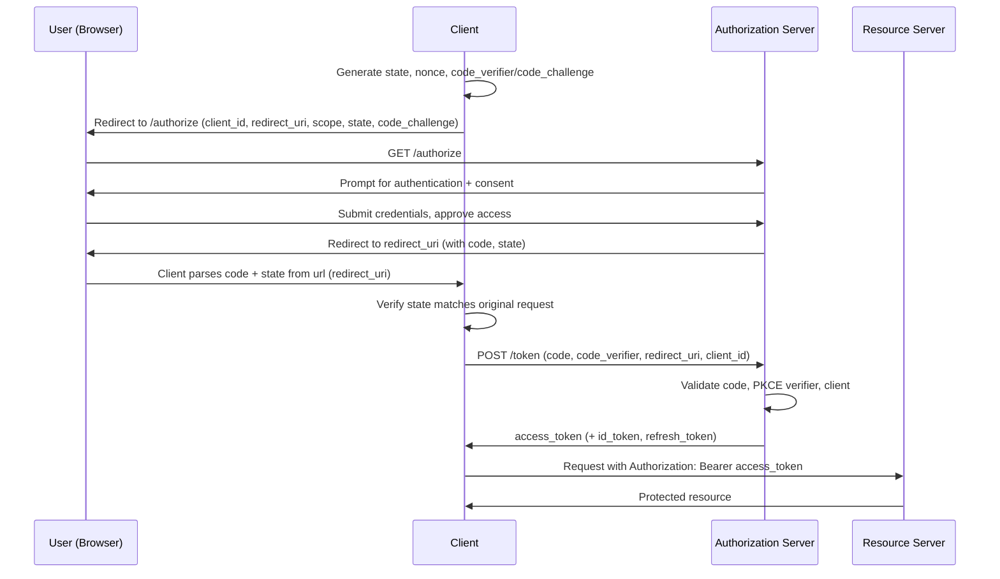

---
prev:
  text: OAuth2
  link: /docs/concepts/oauth2
next:
  text: RP-Initiated Logout
  link: /docs/references/session_logout_flow
---

# Authorization Code Flow

The Authorization Code flow is the most widely recommended OAuth2 [grant type](/docs/concepts/oauth2#flows-grant-types) for any [client](/docs/concepts/oauth2#actors) that can direct a user's browser to an [authorization server](/docs/concepts/oauth2#actors) and receive a redirect back — single-page apps, native/mobile apps, and traditional server-rendered web apps.

Rather than returning tokens directly to the browser (as the now-deprecated Implicit flow did), the client first receives a short-lived, single-use `code`. That code is then exchanged for tokens over a separate back-channel request. This extra hop keeps tokens out of the browser history/URL and gives the authorization server a chance to bind the exchange to the client that started it.

> [!TIP]
> Public clients (SPAs, native/mobile apps) can't safely hold a `client_secret`, since anything shipped to a device or browser can be extracted. [PKCE](/docs/concepts/oauth2#common-terms) closes this gap by having the client prove, at token-exchange time, that it's the same party that started the flow — without ever needing a static secret. It's on by default for every `AuthorizationCodeFlow` in this SDK.

## Participants

* **[Resource Owner](/docs/concepts/oauth2#actors):** the user completing sign-in
* **[Client](/docs/concepts/oauth2#actors):** your application
* **[Authorization Server](/docs/concepts/oauth2#actors):** authenticates the user and issues tokens
* **[Resource Server](/docs/concepts/oauth2#actors):** the API the client ultimately wants to call

## How It Works

1. The client generates a `state` value (and, for OIDC, a `nonce`), along with a PKCE `code_verifier` and its derived `code_challenge`.
2. The client redirects the user's browser to the authorization server's `/authorize` endpoint, including `client_id`, `redirect_uri`, `scope`, `state`, and `code_challenge`.
3. The user authenticates with the authorization server and approves the request (if a consent screen is required).
4. The authorization server redirects the browser back to the client's `redirect_uri` with an authorization `code` and the original `state`.
5. The client verifies the returned `state` matches what it sent in step 1, protecting against CSRF.
6. The client exchanges the `code` — along with the original PKCE `code_verifier` — for tokens via a `POST` to the authorization server's `/token` endpoint.
7. The authorization server validates the `client_id`, `code`, and PKCE `code_verifier`, then returns an access token (plus an ID token and/or refresh token, depending on the requested scopes).
8. The client uses the access token to call the resource server on the user's behalf.

## Security Considerations

* **`state`** must be unique per authorization request and verified on redirect — it's what stops an attacker from tricking a user into completing someone else's flow.
* **`nonce`** (OIDC) is echoed back inside the ID token itself, protecting against replay of a previously issued token.
* **PKCE** protects the `code`-for-token exchange even if the authorization `code` is intercepted in transit, since only the party holding the original `code_verifier` can redeem it.
* **DPoP** goes a step further than PKCE by binding the *issued tokens* to a private key generated on the client. Every request made with a DPoP-bound token — the token exchange itself, and every subsequent call to a resource server — must be accompanied by a fresh proof signed with that key. A leaked or intercepted access/refresh token is useless to an attacker without the private key, which never leaves the client.
* Because everything relies on the client still having its original `state`/`code_verifier`, that data has to survive the full round trip to the authorization server and back — including a full-page redirect on the web.

> [!TIP]
> All of these security controls are enabled by default within the Okta Client JavaScript ecosystem with the exception of **DPoP**, which is easily [configurable](/api/auth-foundation/OAuth2/namespaces/OAuth2Client/classes/Configuration#dpop)

## See Also

* Okta Documentation: [Concepts](https://developer.okta.com/docs/concepts/oauth-openid/#authorization-code-flow-with-pkce-flow) · [Implementation Guide](https://developer.okta.com/docs/guides/implement-grant-type/authcode/main/#authorization-code-flow)
* [oauth.net: Authorization Code Grant Type](https://oauth.net/2/grant-types/authorization-code)
* [RFC 6749, §1.3.1](https://datatracker.ietf.org/doc/html/rfc6749#section-1.3.1)
