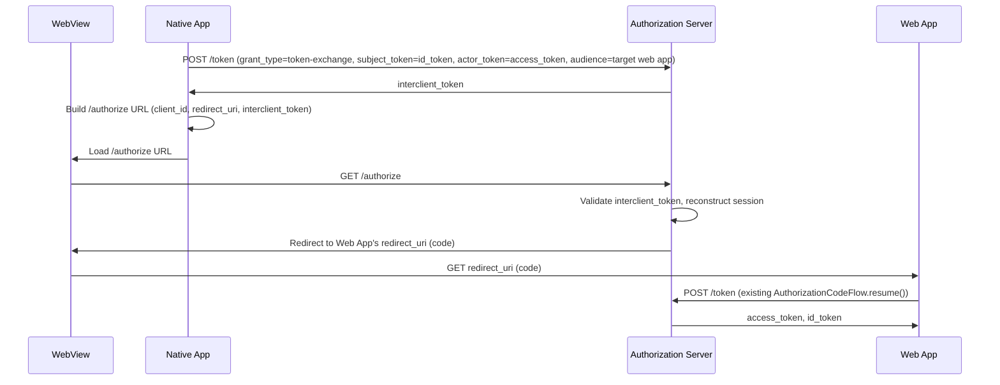

---
prev:
  text: RP-Initiated (Session) Logout
  link: /docs/references/session_logout_flow
next:
  text: Sessions
  link: /docs/concepts/sessions
---

# Native to Web SSO

Native to Web SSO is an Okta feature that lets a native app hand off its authenticated session to a companion web app, without prompting the user to sign in again. It's implemented by [`InterclientAccessFlow`](/api/react-native-platform/Flows/classes/InterclientAccessFlow) in `@okta/react-native-platform`, built on top of the generic [`TokenExchangeFlow`](/api/oauth2-flows/TokenExchangeFlow/classes/TokenExchangeFlow) (an implementation of [RFC 8693 - OAuth 2.0 Token Exchange](https://datatracker.ietf.org/doc/html/rfc8693)).

The flow works by exchanging the native app's `id_token`/`access_token` for a single-use `interclient_token`, then loading the Authorization Server's `/authorize` endpoint — with that token attached — into a `WebView`. The companion web app needs no SDK changes to participate: it receives a normal authorization `code` on its existing callback URL, the same as any other sign-in.

> [!TIP]
> `InterclientAccessFlow` only constructs the `/authorize` URL — it doesn't render or manage a `WebView` itself. Load the returned URL into your own `WebView` component (e.g. `react-native-webview`), so this SDK doesn't take on that dependency.

## Participants

* **[Resource Owner](/docs/concepts/oauth2#actors):** the user whose session is being shared
* **Native App:** your React Native application, already holding an authenticated session
* **Web App:** the companion web application being loaded in a `WebView`
* **[Authorization Server](/docs/concepts/oauth2#actors) / [Identity Provider](/docs/concepts/oauth2#actors):** Okta, brokering the handoff between the two apps

## How It Works

1. The native app requests an `interclient_access` scope alongside its normal scopes when it first authenticates.
2. When the user wants to open the companion web app, the native app calls `InterclientAccessFlow.launch(token)`, which performs a Token Exchange request: `subject_token` is the session's `id_token`, `actor_token` is its `access_token`, `requested_token_type` is `urn:okta:params:oauth:token-type:interclient_token`, and `audience` identifies the target web app (`urn:okta:apps:{targetWebAppClientId}`).
3. The Authorization Server returns a single-use `interclient_token`.
4. `InterclientAccessFlow` builds the Authorization Server's `/authorize` URL, attaching the interclient token, and returns it — the native app loads this URL into a `WebView`.
5. The Authorization Server validates the interclient token, reconstructs the native session server-side, and redirects the `WebView` to the web app's `redirect_uri` with a normal authorization `code` — signing the user in silently, or with a minimal step-up prompt if policy requires more than the native session satisfied.
6. The web app completes sign-in exactly as it would for any other user, via its existing, unmodified `AuthorizationCodeFlow.resume()`.

## Security Considerations

* The `interclient_token` is single-use and short-lived — it's never persisted (e.g. via `Credential.store()`), and is discarded immediately after building the `/authorize` URL.
* An Okta admin must separately enable the Token Exchange grant type on the native app and configure a trust mapping to the target web app — this SDK doesn't manage that configuration, it's an authorization-server-side prerequisite.
* The `WebView` should only ever load Authorization-Server-controlled URLs (the constructed `/authorize` URL and its redirect chain) — don't reuse the same `WebView` instance for arbitrary, untrusted web content.

## See Also

* Okta Documentation: [Native to Web SSO](https://developer.okta.com/docs/guides/native-to-web-sso/main/)
* [RFC 8693 - OAuth 2.0 Token Exchange](https://datatracker.ietf.org/doc/html/rfc8693)