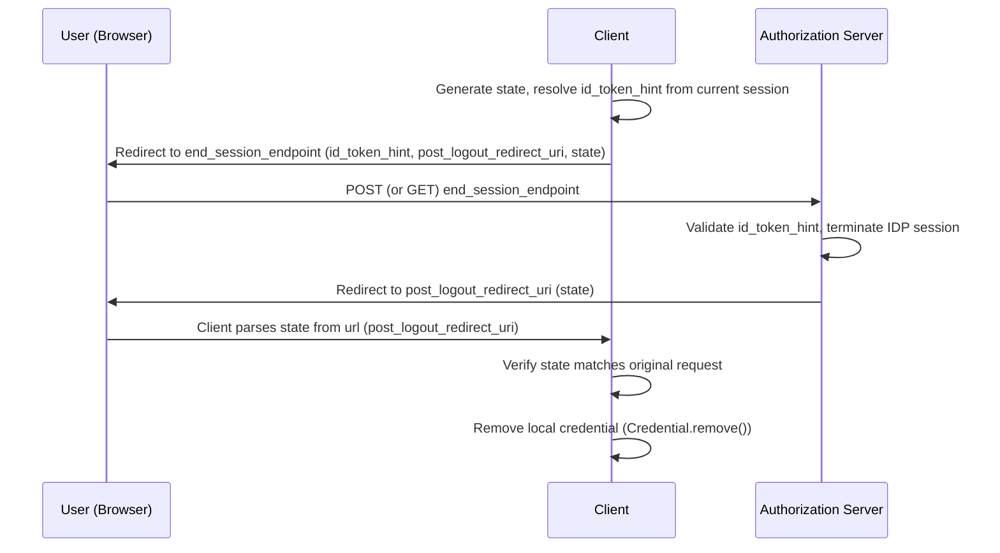

---
prev:
  text: Authorization Code Flow
  link: /docs/references/authorization_code_flow
next:
  text: Sessions
  link: /docs/concepts/sessions
---

# RP-Initiated Logout

RP-Initiated Logout is an OpenID Connect extension that lets a [relying party](/docs/concepts/oauth2#actors) (the client) end a user's session at the [authorization server](/docs/concepts/oauth2#actors) — as opposed to [`revoke()`](/api/auth-foundation/Credential/classes/Credential#revoke), which only invalidates a specific token. It's implemented by [`SessionLogoutFlow`](/api/oauth2-flows/SessionLogoutFlow) in this SDK.

The flow works by redirecting the user's browser to the authorization server's `end_session_endpoint`, passing along the ID token being signed out of (as proof of the session to end) and an optional URL to return to once logout completes.

> [!TIP]
> `SessionLogoutFlow` only builds this redirect URL — it doesn't revoke any tokens itself. Whether the authorization server's `end_session_endpoint` invalidates the underlying tokens server-side is IDP-dependent. To explicitly invalidate a token, use [`Credential.revoke()`](/api/auth-foundation/Credential/classes/Credential#revoke) from `@okta/auth-foundation`.

## Participants

* **[Resource Owner](/docs/concepts/oauth2#actors):** the user signing out
* **[Relying Party](/docs/concepts/oauth2#actors):** your application
* **[Authorization Server](/docs/concepts/oauth2#actors) / [Identity Provider](/docs/concepts/oauth2#actors):** owns the session being terminated

## How It Works

1. The client resolves the ID token for the session being ended and generates a `state` value.
2. The client redirects the user's browser to the authorization server's `end_session_endpoint`, including `id_token_hint`, `post_logout_redirect_uri`, and `state`.
3. The authorization server validates the `id_token_hint` and terminates the session it represents at the IDP.
4. The authorization server redirects the browser back to `post_logout_redirect_uri` with the original `state`.
5. The client verifies the returned `state` matches what it sent in step 1.
6. The client removes its own local credential (see [Managing User Credentials](/docs/guides/Credential#removing)), since RP-Initiated Logout only ends the IDP session — it doesn't clear anything the client itself persisted.

## Security Considerations

* **`state`** must be unique per logout request and verified on redirect, the same protection it provides during [Authorization Code Flow](/docs/references/authorization_code_flow#security-considerations).
* **`id_token_hint`** must be a token previously issued to this client — an authorization server should refuse to end a session on behalf of an arbitrary/unrelated ID token.
* **`post_logout_redirect_uri`** should be validated by the authorization server against a pre-registered allowlist, the same way `redirect_uri` is validated during sign-in, to prevent an attacker from redirecting a signed-out user somewhere unexpected.
* Ending the IDP session doesn't retroactively invalidate tokens already issued for it. If tokens need to stop working immediately, revoke them explicitly with [`Credential.revoke()`](/api/auth-foundation/Credential/classes/Credential#revoke) in addition to running this flow.
* It's recommended to make a `POST` request to the `end_session_endpoint` instead of `GET`. In a `GET` request, the ID token will be exposed as a query parameter (via `id_token_hint`). A `POST` request does not have the same concern since the request body is hidden.

> [!NOTE]
> In [Single Sign-On](/docs/concepts/oauth2#oauth2-extensions) scenarios, ending the IDP session may sign the user out of *every* application sharing that session — not just this one. See [Managing User Credentials](/docs/guides/Credential#use-sessionlogout) for guidance on when `SessionLogoutFlow` is (and isn't) the right tool.

## See Also

* Okta Documentation: [API Reference](https://developer.okta.com/docs/api/openapi/okta-oauth/oauth/tag/OrgAS/#tag/OrgAS/operation/logoutWithPost)
* [OpenID Connect RP-Initiated Logout 1.0](https://openid.net/specs/openid-connect-rpinitiated-1_0.html)
